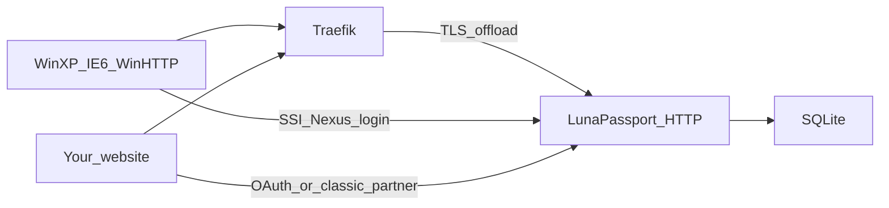

# LunaPassport

**English** | [Русский](README.ru.md)

[](https://go.dev/)
[](https://learn.microsoft.com/en-us/openspecs/windows_protocols/ms-pass/a059aaaf-2d4a-40c6-ad96-7175c379ffd7)
[](https://docs.docker.com/compose/)
[](#limits--security)
[](https://github.com/DanielMTeam/lunapassport)

Isolated Windows XP .NET Passport SSI 1.4 lab. Emulates retired Passport
endpoints and the browser/Wizard flow for local testing. Also acts as a small
lab identity provider so **your own websites** can sign users in via OAuth or
classic Passport partner cookies.

Tokens and credentials work only inside this lab — they are not accepted by
real Microsoft services.

> **Lab only.** Do not expose this mock on the public internet, do not reuse
> real passwords, and do not expect these tokens to work against production
> services. The Go service is HTTP-only; Traefik or Nginx terminates TLS.

## Documentation map

| Topic | Where |
| --- | --- |
| Run the server, domains, Docker, XP | this README |
| **Sign users into your website** (OAuth + classic partner) | **[docs/partner-sso.md](docs/partner-sso.md)** |
| Agent / contributor guidelines | [AGENTS.md](AGENTS.md) |

## What it implements

**Passport SSI 1.4 (XP / WinHTTP)**

- Nexus `GET /rdr/pprdr.asp` with a dynamic `PassportURLs` header
- Wizard on `/defaultwiz.asp`, `/uixpwiz.srf`, `/UIXPWiz.srf`
- SSI login `/login2.srf` and `/login2.asp`
- `WWW-Authenticate: Passport1.4` challenge and `Authorization` parsing
- Local tokens plus `PPAuth`, `MSPAuth`, `MSPProf` cookies
- Profile `/ppsecure/MSRV_EditProfile.asp`, logout, cancelled-login retry

**Partner SSO (your websites)**

- OAuth 2.0 Authorization Code (`/oauth/*`) for any domain
- Partner app admin UI at `/partners`
- Classic partner return with allowlisted `ru` + `MSPAuth` on a shared cookie domain
- Session check `/partner` and JSON `/partner/verify`

**Storage**

- SQLite via GORM with automatic schema migration

## How it fits together



Three consumer paths:

1. **Windows XP** — Nexus + SSI `Authorization: Passport1.4` (unchanged lab protocol).
2. **Any modern website** — OAuth Authorization Code ([guide](docs/partner-sso.md#oauth-20-any-website)).
3. **Site on the shared cookie domain** — classic `MSPAuth` redirect ([guide](docs/partner-sso.md#classic-passport-partner-shared-cookie-domain)).

## Quick start

Requires a modern Go toolchain. Docker is optional.

```powershell
go run .\cmd\lunapassport -http :8080
```

On first start the app creates `accounts.db` with a seeded test account:

```text
Email:    test@example.com
Password: testpass
Name:     Test Passport
```

Override the database path with `-db`:

```powershell
go run .\cmd\lunapassport -http :8080 -db .\accounts.db
```

Useful lab URLs after start:

| URL | Purpose |
| --- | --- |
| `/static/netpass/index.html` | Landing page |
| `/oauth/login` | Browser sign-in |
| `/partners` | Register OAuth / classic partner apps |
| `/ppsecure/MSRV_EditProfile.asp` | Edit account profile |
| `/logout` | Sign out |

The secret question and answer are stored locally, but password recovery through
them is not implemented yet.

### Project layout

| Path | Role |
| --- | --- |
| `cmd/lunapassport/main.go` | HTTP server bootstrap and configuration |
| `cmd/lunapassport/server.go` | Routes, session state, healthcheck |
| `cmd/lunapassport/passport.go` | Nexus, SSI challenge, tokens, classic partner |
| `cmd/lunapassport/oauth.go` | OAuth authorize, login, token, userinfo |
| `cmd/lunapassport/partners.go` | Partner app registration UI |
| `cmd/lunapassport/wizard.go` | Wizard and account profile |
| `cmd/lunapassport/accounts.go` | GORM models, SQLite, migrations |
| `cmd/lunapassport/static/` | Wizard, OAuth, and lab HTML/CSS |
| `docs/partner-sso.md` | Partner SSO integration guide |
| `tests/` | Black-box SSI and OAuth/partner tests |

## Domain configuration

Docker Compose defaults to the project staging hosts. Copy `.env.example` to
`.env` when you need custom values:

```text
PASSPORT_HOST=passport-staging.lunastore.app
MEMBERSERVICES_HOST=memberservices-staging.lunastore.app
PASSPORT_COOKIE_DOMAIN=.lunastore.app
```

- `PASSPORT_HOST` — Nexus, login, registration, redirects, Wizard, OAuth UI
- `MEMBERSERVICES_HOST` — profile and help pages
- `PASSPORT_COOKIE_DOMAIN` — shared parent domain for Passport cookies (required for classic partner)
- `OAUTH_SECRET_PEPPER` — pepper for hashing OAuth client secrets (lab default if empty)

Running Go directly without flags keeps the historical `*.passport.com` defaults.
Pass the flags below or set the matching environment variables.

```text
-http                    HTTP listen address (default :8080)
-db                      SQLite file path (default accounts.db)
-passport-host           central Passport host
-memberservices-host     profile and help host
-passport-cookie-domain  shared cookie domain
-oauth-secret-pepper     pepper for hashing OAuth client secrets
```

## Partner SSO (short overview)

Full steps, API tables, troubleshooting, and a Go callback sample:
**[docs/partner-sso.md](docs/partner-sso.md)** ([Русский](docs/partner-sso.ru.md)).

### 1. Register the app

Open `/partners` → sign in → create an application → copy `client_id` /
`client_secret` (secret shown once). List exact redirect / return URIs.
Enable **classic Passport partner** only if you need shared-domain `MSPAuth`.

### 2a. OAuth (any domain)

```text
Browser → GET /oauth/authorize?response_type=code&client_id=...&redirect_uri=...&state=...
       → login / Allow
       → redirect_uri?code=...&state=...
Your backend → POST /oauth/token → access_token
            → GET /oauth/userinfo (Authorization: Bearer ...)
```

```powershell
curl.exe -s -X POST http://127.0.0.1:8080/oauth/token `
  -d "grant_type=authorization_code" `
  -d "code=AUTH_CODE" `
  -d "redirect_uri=https://yoursite.example/callback" `
  -d "client_id=CLIENT_ID" `
  -d "client_secret=CLIENT_SECRET"

curl.exe -s http://127.0.0.1:8080/oauth/userinfo `
  -H "Authorization: Bearer ACCESS_TOKEN"
```

### 2b. Classic partner (shared cookie domain only)

```text
Browser → GET /login2.srf?browser=1&ru=https://app.example.com/passport/return
       → MSPAuth set + 302 to allowlisted ru

Backend  → GET /partner/verify  (Cookie: MSPAuth=...)
```

Cross-domain sites must use OAuth. WinHTTP SSI still returns `Authentication-Info`
without an HTTP redirect.

## Docker Compose and external Traefik

Compose starts only the Go service on internal HTTP port `8080`. Traefik must
already be running and attached to the external Docker network `traefik`:

```powershell
docker network create traefik
docker compose up --build -d
docker compose ps
```

To run the published GHCR image instead of building locally:

```powershell
docker compose -f docker-compose.ext.yml up -d
```

Set `LUNAPASSPORT_IMAGE` to use another tag, for example
`ghcr.io/danielmteam/lunapassport:v1.0.0`.

The `traefik` network must exist before Compose starts. External Traefik needs a
Docker provider and entrypoints `web` and `websecure`. TLS certificates and
their file paths belong to the external Traefik deployment. This Compose file
does not publish ports or start a second Traefik instance.

Account state lives in `_data/accounts.db`.

The certificate must cover every hostname XP will use. Hostnames come from the
hosts file and the certificate, not from this Compose stack.

Stop the environment:

```powershell
docker compose down
```

## GitHub Container Registry

GitHub Actions publishes the image to GHCR:

- pushes to `main` publish `ghcr.io/<owner>/lunapassport:latest`;
- version tags such as `v1.0.0` publish `ghcr.io/<owner>/lunapassport:v1.0.0`;
- successful pull requests publish `ghcr.io/<owner>/lunapassport:pr-<number>`
  and add the pull command to the PR comments.
- published images include both `linux/amd64` and `linux/arm64` platforms.

The PR package is rebuilt when the PR changes. The package may require GitHub
Container Registry authentication if the repository package is private.

The scheduled cleanup removes `pr-<number>` images for closed pull requests
and for pull requests that have not been updated for 30 days. It also runs
immediately when a pull request is closed and can be started manually from
the Actions tab.

## Windows XP

For the staging setup, add to the XP `hosts` file:

```text
192.168.67.1 passport-staging.lunastore.app memberservices-staging.lunastore.app
```

Replace the IP with the machine that runs Traefik. Import the signing CA once
into Trusted Root Certification Authorities.

For WinHTTP Passport Test, import:

```text
tools/passport-test.reg
```

That file writes Passport URLs under `Internet Settings\Passport`, which the
Wizard reads. On a clean system, `RegistrationUrl`, `LoginServerUrl`,
`Properties`, `Help`, `Privacy`, and `GeneralRedir` point at the staging hosts.
On a previously used XP box, old Passport URLs may remain cached — restart the
app or use a clean profile to clear that cache. For other domains, start from
`tools/passport-test.reg.example` and replace the host values.

Historical default domains:

```text
192.168.67.1 nexus.passport.com login.passport.com register.passport.com
192.168.67.1 memberservices.passport.com www.passport.com nexusrdr.passport.com
```

## Verify

Full test suite (SSI regression + OAuth/classic partner):

```powershell
go test -count=1 ./...
```

Build:

```powershell
go build ./cmd/lunapassport
```

HTTP smoke test:

```powershell
curl.exe -i http://127.0.0.1:8080/healthz
curl.exe -i http://127.0.0.1:8080/rdr/pprdr.asp
curl.exe -i http://127.0.0.1:8080/login2.srf
curl.exe -i -H "Authorization: Passport1.4 sign-in=test%40example.com,pwd=testpass" http://127.0.0.1:8080/login2.srf
curl.exe -i http://127.0.0.1:8080/partners
```

For an XP-oriented capture, record `/rdr/pprdr.asp`, then `/login2.srf`, then a
request with `Authorization: Passport1.4`.

## Limits & security

This project is an isolated laboratory only. Do not publish it to the internet,
do not use real passwords, and do not rely on these mock tokens for access to
real services.

OAuth client secrets are hashed at rest, but this is still a lab store — treat
`accounts.db`, pepper, and secrets as disposable local data.

## References

- [Partner SSO guide](docs/partner-sso.md) — integrate your website
- [Passport Authentication in WinHTTP](https://learn.microsoft.com/en-us/windows/win32/winhttp/passport-authentication-in-winhttp) — Nexus configuration, login flow, and XP credential storage
- [MS-PASS: Authentication Server Challenge](https://learn.microsoft.com/en-us/openspecs/windows_protocols/ms-pass/a059aaaf-2d4a-40c6-ad96-7175c379ffd7) — `WWW-Authenticate: Passport1.4` challenge syntax
- [MS-PASS: Protocol Examples](https://learn.microsoft.com/en-us/openspecs/windows_protocols/ms-pass/2c80637d-438c-4d4b-adc5-903170a779f3) — request, challenge, token, and cookie exchanges
- [NewWDEvents.PassportAuthenticate](https://learn.microsoft.com/en-us/windows/win32/shell/inewwdevents-passportauthenticate) — XP Wizard authentication callback
- [WebWizardHost](https://learn.microsoft.com/en-us/windows/win32/shell/webwizardhost) — `FinalNext`, `FinalBack`, `Cancel`, and Wizard page integration
