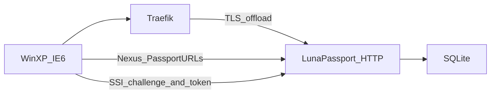

# LunaPassport

[English](README.md) | **Русский**

[](https://go.dev/)
[](https://learn.microsoft.com/en-us/openspecs/windows_protocols/ms-pass/a059aaaf-2d4a-40c6-ad96-7175c379ffd7)
[](https://docs.docker.com/compose/)
[](#ограничения-и-безопасность)
[](https://github.com/DanielMTeam/lunapassport)

Реализация Microsoft .NET Passport SSI 1.4 для Windows XP.
Эмулирует выведенные из эксплуатации Passport-эндпоинты и браузерный/Wizard
поток для локального тестирования. Токены и учётные данные действуют только
внутри этой лаборатории — реальные сервисы Microsoft их не принимают.

> **Только для локального использования.** Не публикуйте этот mock в интернете, не используйте
> реальные пароли и не рассчитывайте на эти токены для доступа к продакшен-
> сервисам. Go-сервис слушает только HTTP; TLS завершается на Traefik или Nginx.

## Что реализовано

- Nexus endpoint `GET /rdr/pprdr.asp` с динамическим заголовком `PassportURLs`
- Passport Wizard на `/defaultwiz.asp`, `/uixpwiz.srf` и `/UIXPWiz.srf`
- SSI login endpoints `/login2.srf` и `/login2.asp`
- Challenge `WWW-Authenticate: Passport1.4` и разбор `Authorization`
- Локальные Passport-токены, cookies `PPAuth`, `MSPAuth` и `MSPProf`
- Защищённая страница профиля `/ppsecure/MSRV_EditProfile.asp`
- Изменение email, имени, пароля, секретного вопроса и ответа
- Logout и страница отмены входа с возможностью повторить авторизацию
- `/partner` для проверки созданной локальной сессии
- SQLite-хранилище через GORM с автоматической миграцией схемы

## Как это связано



## Быстрый старт

Нужен современный Go. Docker не обязателен:

```powershell
go run .\cmd\lunapassport -http :8080
```

При первом запуске создаётся `accounts.db` с локальной тестовой учёткой:

```text
Email:    test@example.com
Password: testpass
Name:     Test Passport
```

Путь к базе можно задать через `-db`:

```powershell
go run .\cmd\lunapassport -http :8080 -db .\accounts.db
```

После входа настройки аккаунта редактируются на:

```text
/ppsecure/MSRV_EditProfile.asp
```

Секретный вопрос и ответ сохраняются локально, но сценарий восстановления
пароля через них пока не реализован.

### Структура проекта

| Путь | Назначение |
| --- | --- |
| `cmd/lunapassport/main.go` | Запуск HTTP-сервера и конфигурация |
| `cmd/lunapassport/server.go` | Маршруты, состояние сессий, healthcheck |
| `cmd/lunapassport/passport.go` | Nexus, SSI challenge, токены и cookies |
| `cmd/lunapassport/wizard.go` | Wizard, профиль аккаунта и настройки |
| `cmd/lunapassport/accounts.go` | Модели GORM, SQLite и миграции |
| `cmd/lunapassport/static/` | Wizard и LunaPassport HTML/CSS/изображения |
| `tests/lunapassport_test.go` | Black-box тест: собирает и запускает сервер как процесс |

## Конфигурация доменов

Для Docker Compose по умолчанию используются staging-домены проекта. При
необходимости скопируйте `.env.example` в `.env` и укажите свои значения:

```text
PASSPORT_HOST=passport-staging.lunastore.app
MEMBERSERVICES_HOST=memberservices-staging.lunastore.app
PASSPORT_COOKIE_DOMAIN=.lunastore.app
```

- `PASSPORT_HOST` — Nexus, login, регистрация, redirect и Wizard
- `MEMBERSERVICES_HOST` — профиль и help-страница
- `PASSPORT_COOKIE_DOMAIN` — общий родительский домен обоих хостов (иначе cookies не передаются)

При запуске Go напрямую без флагов остаются исторические значения
`*.passport.com`. Передайте флаги ниже или задайте переменные окружения.

```text
-http                    HTTP listen address (по умолчанию :8080)
-db                      путь к SQLite-файлу (по умолчанию accounts.db)
-passport-host           центральный Passport host
-memberservices-host     host профиля и help-страницы
-passport-cookie-domain  общий домен cookies
```

## Docker Compose и внешний Traefik

Compose запускает только Go-сервис по HTTP на внутреннем порту `8080`. Traefik
должен быть запущен отдельно и подключён к внешней Docker-сети `traefik`:

```powershell
docker network create traefik
docker compose up --build -d
docker compose ps
```

Для запуска опубликованного образа из GHCR без локальной сборки:

```powershell
docker compose -f docker-compose.ext.yml up -d
```

Другой тег можно задать через `LUNAPASSPORT_IMAGE`, например
`ghcr.io/danielmteam/lunapassport:v1.0.0`.

Сеть `traefik` должна существовать до запуска Compose. Внешний Traefik должен
иметь Docker provider и entrypoints `web` и `websecure`. TLS-сертификаты и их
пути принадлежат внешнему Traefik. Этот Compose не публикует порты и не
запускает второй экземпляр Traefik.

База и состояние аккаунта лежат в `_data/accounts.db`.

Сертификат должен содержать все домены, через которые будет обращаться XP.
Имена хостов задаются hosts-файлом и сертификатом, а не этим Compose-стеком.

Остановить окружение:

```powershell
docker compose down
```

## GitHub Container Registry

GitHub Actions публикует Docker-образ в GHCR:

- push в `main` публикует `ghcr.io/<owner>/lunapassport:latest`;
- тег версии вроде `v1.0.0` публикует `ghcr.io/<owner>/lunapassport:v1.0.0`;
- успешный pull request публикует `ghcr.io/<owner>/lunapassport:pr-<number>`
  и добавляет команду загрузки в комментарий PR.
- опубликованные образы содержат платформы `linux/amd64` и `linux/arm64`.

PR-пакет пересобирается при изменении PR. Если пакет приватный, для GHCR нужно
сначала выполнить вход через GitHub Container Registry.

Плановая очистка удаляет образы `pr-<number>` для закрытых PR и для PR, которые
не обновлялись 30 дней. При закрытии PR очистка запускается сразу; вручную её
также можно запустить из вкладки Actions.

## Windows XP

Для staging-конфигурации добавьте в `hosts` XP:

```text
192.168.67.1 passport-staging.lunastore.app memberservices-staging.lunastore.app
```

IP замените на адрес машины с Traefik. Сертификат подписывающего CA нужно один
раз импортировать в Trusted Root Certification Authorities.

Для WinHTTP Passport Test можно импортировать:

```text
tools/passport-test.reg
```

Файл настраивает Passport URL в `Internet Settings\Passport`, которые читает
Wizard. На чистой системе `RegistrationUrl`, `LoginServerUrl`, `Properties`,
`Help`, `Privacy` и `GeneralRedir` сразу указывают на staging-домены. На уже
использовавшейся XP старые Passport URL могут оставаться в кэше — перезапуск
приложения или чистый профиль нужны только для сброса этого кэша. Для других
доменов используйте `tools/passport-test.reg.example` и замените значения хостов.

Исторические домены по умолчанию:

```text
192.168.67.1 nexus.passport.com login.passport.com register.passport.com
192.168.67.1 memberservices.passport.com www.passport.com nexusrdr.passport.com
```

## Проверка

Полный набор тестов:

```powershell
go test -count=1 ./...
```

Сборка:

```powershell
go build ./cmd/lunapassport
```

Простой HTTP smoke test:

```powershell
curl.exe -i http://127.0.0.1:8080/healthz
curl.exe -i http://127.0.0.1:8080/rdr/pprdr.asp
curl.exe -i http://127.0.0.1:8080/login2.srf
curl.exe -i -H "Authorization: Passport1.4 sign-in=test%40example.com,pwd=testpass" http://127.0.0.1:8080/login2.srf
```

Для XP-теста полезно зафиксировать последовательность запросов:
`/rdr/pprdr.asp`, затем `/login2.srf`, затем запрос с
`Authorization: Passport1.4`.

## Ограничения и безопасность

Проект предназначен только для изолированной лаборатории. Не публикуйте его в
интернете, не используйте реальные пароли и не рассчитывайте на эти mock-токены
для доступа к настоящим сервисам.

## Ссылки

- [Passport Authentication in WinHTTP](https://learn.microsoft.com/en-us/windows/win32/winhttp/passport-authentication-in-winhttp) — Nexus, login flow и хранение credentials в XP
- [MS-PASS: Authentication Server Challenge](https://learn.microsoft.com/en-us/openspecs/windows_protocols/ms-pass/a059aaaf-2d4a-40c6-ad96-7175c379ffd7) — синтаксис challenge `WWW-Authenticate: Passport1.4`
- [MS-PASS: Protocol Examples](https://learn.microsoft.com/en-us/openspecs/windows_protocols/ms-pass/2c80637d-438c-4d4b-adc5-903170a779f3) — обмен request / challenge / token / cookie
- [NewWDEvents.PassportAuthenticate](https://learn.microsoft.com/en-us/windows/win32/shell/inewwdevents-passportauthenticate) — callback аутентификации XP Wizard
- [WebWizardHost](https://learn.microsoft.com/en-us/windows/win32/shell/webwizardhost) — `FinalNext`, `FinalBack`, `Cancel` и интеграция страниц Wizard
