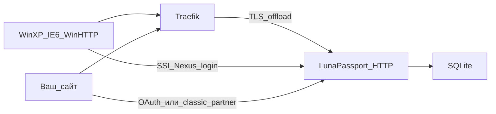

# LunaPassport

[English](README.md) | **Русский**

[](https://go.dev/)
[](https://learn.microsoft.com/en-us/openspecs/windows_protocols/ms-pass/a059aaaf-2d4a-40c6-ad96-7175c379ffd7)
[](https://docs.docker.com/compose/)
[](#ограничения-и-безопасность)
[](https://github.com/DanielMTeam/lunapassport)

Реализация Microsoft .NET Passport SSI 1.4 для Windows XP.
Эмулирует выведенные из эксплуатации Passport-эндпоинты и браузерный/Wizard
поток для локального тестирования. Также работает как небольшой лабораторный
IdP: **ваши сайты** могут пускать пользователей через OAuth или классические
Passport partner cookies.

Токены и учётные данные действуют только внутри этой лаборатории — реальные
сервисы Microsoft их не принимают.

> **Только для локального использования.** Не публикуйте этот mock в интернете,
> не используйте реальные пароли и не рассчитывайте на эти токены для доступа к
> продакшен-сервисам. Go-сервис слушает только HTTP; TLS завершается на Traefik
> или Nginx.

## Карта документации

| Тема | Где читать |
| --- | --- |
| Запуск, домены, Docker, XP | этот README |
| **Вход на своём сайте** (OAuth + classic partner) | **[docs/partner-sso.ru.md](docs/partner-sso.ru.md)** |
| Правила для агентов / контрибьюторов | [AGENTS.md](AGENTS.md) |

## Что реализовано

**Passport SSI 1.4 (XP / WinHTTP)**

- Nexus `GET /rdr/pprdr.asp` с динамическим `PassportURLs`
- Wizard на `/defaultwiz.asp`, `/uixpwiz.srf`, `/UIXPWiz.srf`
- SSI login `/login2.srf` и `/login2.asp`
- Challenge `WWW-Authenticate: Passport1.4` и разбор `Authorization`
- Локальные токены и cookies `PPAuth`, `MSPAuth`, `MSPProf`
- Профиль `/ppsecure/MSRV_EditProfile.asp`, logout, отмена входа с retry

**Partner SSO (ваши сайты)**

- OAuth 2.0 Authorization Code (`/oauth/*`) для любого домена
- Админка приложений `/partners`
- Classic partner return с allowlist `ru` + `MSPAuth` на общем cookie-домене
- Проверка сессии `/partner` и JSON `/partner/verify`

**Хранилище**

- SQLite через GORM с автомиграцией схемы

## Как это связано



Три сценария потребителей:

1. **Windows XP** — Nexus + SSI `Authorization: Passport1.4` (протокол лаборатории).
2. **Любой современный сайт** — OAuth Authorization Code ([гайд](docs/partner-sso.ru.md#oauth-20-любой-сайт)).
3. **Сайт на общем cookie-домене** — classic `MSPAuth` redirect ([гайд](docs/partner-sso.ru.md#классический-passport-partner-общий-cookie-домен)).

## Быстрый старт

Нужен современный Go. Docker не обязателен:

```powershell
go run .\cmd\lunapassport -http :8080
```

При первом запуске создаётся `accounts.db` с тестовой учёткой:

```text
Email:    test@example.com
Password: testpass
Name:     Test Passport
```

Путь к базе:

```powershell
go run .\cmd\lunapassport -http :8080 -db .\accounts.db
```

Полезные URL после старта:

| URL | Назначение |
| --- | --- |
| `/static/netpass/index.html` | Landing |
| `/oauth/login` | Браузерный вход |
| `/partners` | Регистрация OAuth / classic приложений |
| `/ppsecure/MSRV_EditProfile.asp` | Профиль аккаунта |
| `/logout` | Выход |

Секретный вопрос и ответ сохраняются локально, но восстановление пароля через
них пока не реализовано.

### Структура проекта

| Путь | Назначение |
| --- | --- |
| `cmd/lunapassport/main.go` | Запуск HTTP-сервера и конфигурация |
| `cmd/lunapassport/server.go` | Маршруты, сессии, healthcheck |
| `cmd/lunapassport/passport.go` | Nexus, SSI, токены, classic partner |
| `cmd/lunapassport/oauth.go` | OAuth authorize, login, token, userinfo |
| `cmd/lunapassport/partners.go` | UI регистрации приложений |
| `cmd/lunapassport/wizard.go` | Wizard и профиль |
| `cmd/lunapassport/accounts.go` | Модели GORM, SQLite, миграции |
| `cmd/lunapassport/static/` | Wizard, OAuth и lab HTML/CSS |
| `docs/partner-sso.ru.md` | Гайд по Partner SSO |
| `tests/` | Black-box тесты SSI и OAuth/partner |

## Конфигурация доменов

Для Docker Compose по умолчанию используются staging-домены. При необходимости
скопируйте `.env.example` в `.env`:

```text
PASSPORT_HOST=passport-staging.lunastore.app
MEMBERSERVICES_HOST=memberservices-staging.lunastore.app
PASSPORT_COOKIE_DOMAIN=.lunastore.app
```

- `PASSPORT_HOST` — Nexus, login, регистрация, redirect, Wizard, OAuth UI
- `MEMBERSERVICES_HOST` — профиль и help
- `PASSPORT_COOKIE_DOMAIN` — общий parent domain для cookies (нужен для classic partner)
- `OAUTH_SECRET_PEPPER` — pepper для хеша OAuth client secrets (если пусто — lab default)

Без флагов остаются исторические `*.passport.com`. Флаги или переменные окружения:

```text
-http                    HTTP listen address (по умолчанию :8080)
-db                      путь к SQLite (по умолчанию accounts.db)
-passport-host           центральный Passport host
-memberservices-host     host профиля и help
-passport-cookie-domain  общий домен cookies
-oauth-secret-pepper     pepper для хеша OAuth client secrets
```

## Partner SSO (кратко)

Полные шаги, таблицы API, troubleshooting и Go-пример callback:
**[docs/partner-sso.ru.md](docs/partner-sso.ru.md)** ([English](docs/partner-sso.md)).

### 1. Зарегистрировать приложение

Откройте `/partners` → войдите → создайте приложение → скопируйте `client_id` /
`client_secret` (секрет один раз). Укажите точные redirect / return URI.
Галочку **classic Passport partner** включайте только для shared-domain `MSPAuth`.

### 2a. OAuth (любой домен)

```text
Browser → GET /oauth/authorize?response_type=code&client_id=...&redirect_uri=...&state=...
       → login / Allow
       → redirect_uri?code=...&state=...
Backend  → POST /oauth/token → access_token
         → GET /oauth/userinfo (Authorization: Bearer ...)
```

```powershell
curl.exe -s -X POST http://127.0.0.1:8080/oauth/token `
  -d "grant_type=authorization_code" `
  -d "code=AUTH_CODE" `
  -d "redirect_uri=https://yoursite.example/callback" `
  -d "client_id=CLIENT_ID" `
  -d "client_secret=CLIENT_SECRET"

curl.exe -s http://127.0.0.1:8080/oauth/userinfo `
  -H "Authorization: Bearer ACCESS_TOKEN"
```

### 2b. Classic partner (только общий cookie-домен)

```text
Browser → GET /login2.srf?browser=1&ru=https://app.example.com/passport/return
       → MSPAuth + 302 на allowlisted ru

Backend  → GET /partner/verify  (Cookie: MSPAuth=...)
```

Чужие домены — только OAuth. WinHTTP SSI по-прежнему отдаёт `Authentication-Info`
без HTTP-redirect.

## Docker Compose и внешний Traefik

Compose запускает только Go-сервис на внутреннем HTTP `:8080`. Traefik должен
быть уже запущен и подключён к внешней Docker-сети `traefik`:

```powershell
docker network create traefik
docker compose up --build -d
docker compose ps
```

Для запуска опубликованного образа из GHCR без локальной сборки:

```powershell
docker compose -f docker-compose.ext.yml up -d
```

Другой тег можно задать через `LUNAPASSPORT_IMAGE`, например
`ghcr.io/danielmteam/lunapassport:v1.0.0`.

Сеть `traefik` должна существовать до запуска Compose. Внешний Traefik должен
иметь Docker provider и entrypoints `web` и `websecure`. TLS-сертификаты и их
пути принадлежат внешнему Traefik. Этот Compose не публикует порты и не
запускает второй экземпляр Traefik.

База и состояние аккаунта лежат в `_data/accounts.db`.

Сертификат должен покрывать все hostname, через которые ходит XP.

```powershell
docker compose down
```

## GitHub Container Registry

GitHub Actions публикует Docker-образ в GHCR:

- push в `main` публикует `ghcr.io/<owner>/lunapassport:latest`;
- тег версии вроде `v1.0.0` публикует `ghcr.io/<owner>/lunapassport:v1.0.0`;
- успешный pull request публикует `ghcr.io/<owner>/lunapassport:pr-<number>`
  и добавляет команду загрузки в комментарий PR.
- опубликованные образы содержат платформы `linux/amd64` и `linux/arm64`.

PR-пакет пересобирается при изменении PR. Если пакет приватный, для GHCR нужно
сначала выполнить вход через GitHub Container Registry.

Плановая очистка удаляет образы `pr-<number>` для закрытых PR и для PR, которые
не обновлялись 30 дней. При закрытии PR очистка запускается сразу; вручную её
также можно запустить из вкладки Actions.

## Windows XP

В `hosts` XP для staging:

```text
192.168.67.1 passport-staging.lunastore.app memberservices-staging.lunastore.app
```

IP — машина с Traefik. CA один раз в Trusted Root Certification Authorities.

Для WinHTTP Passport Test:

```text
tools/passport-test.reg
```

Файл настраивает Passport URL в `Internet Settings\Passport`, которые читает
Wizard. На чистой системе `RegistrationUrl`, `LoginServerUrl`, `Properties`,
`Help`, `Privacy` и `GeneralRedir` сразу указывают на staging-домены. На уже
использовавшейся XP старые Passport URL могут оставаться в кэше — перезапуск
приложения или чистый профиль нужны только для сброса этого кэша. Для других
доменов используйте `tools/passport-test.reg.example` и замените значения хостов.

Исторические домены:

```text
192.168.67.1 nexus.passport.com login.passport.com register.passport.com
192.168.67.1 memberservices.passport.com www.passport.com nexusrdr.passport.com
```

## Проверка

Полный набор тестов (SSI + OAuth/classic partner):

```powershell
go test -count=1 ./...
```

Сборка:

```powershell
go build ./cmd/lunapassport
```

Smoke:

```powershell
curl.exe -i http://127.0.0.1:8080/healthz
curl.exe -i http://127.0.0.1:8080/rdr/pprdr.asp
curl.exe -i http://127.0.0.1:8080/login2.srf
curl.exe -i -H "Authorization: Passport1.4 sign-in=test%40example.com,pwd=testpass" http://127.0.0.1:8080/login2.srf
curl.exe -i http://127.0.0.1:8080/partners
```

Для XP полезно зафиксировать: `/rdr/pprdr.asp` → `/login2.srf` → запрос с
`Authorization: Passport1.4`.

## Ограничения и безопасность

Только изолированная лаборатория. Не публикуйте в интернет, не используйте
реальные пароли, не опирайтесь на mock-токены для настоящих сервисов.

OAuth client secrets хешируются, но это всё равно lab-хранилище: `accounts.db`,
pepper и секреты считайте одноразовыми локальными данными.

## Ссылки

- [Гайд Partner SSO](docs/partner-sso.ru.md) — интеграция своего сайта
- [Passport Authentication in WinHTTP](https://learn.microsoft.com/en-us/windows/win32/winhttp/passport-authentication-in-winhttp) — Nexus, login flow и credentials в XP
- [MS-PASS: Authentication Server Challenge](https://learn.microsoft.com/en-us/openspecs/windows_protocols/ms-pass/a059aaaf-2d4a-40c6-ad96-7175c379ffd7) — синтаксис challenge `WWW-Authenticate: Passport1.4`
- [MS-PASS: Protocol Examples](https://learn.microsoft.com/en-us/openspecs/windows_protocols/ms-pass/2c80637d-438c-4d4b-adc5-903170a779f3) — обмен request / challenge / token / cookie
- [NewWDEvents.PassportAuthenticate](https://learn.microsoft.com/en-us/windows/win32/shell/inewwdevents-passportauthenticate) — callback XP Wizard
- [WebWizardHost](https://learn.microsoft.com/en-us/windows/win32/shell/webwizardhost) — `FinalNext`, `FinalBack`, `Cancel` и страницы Wizard
