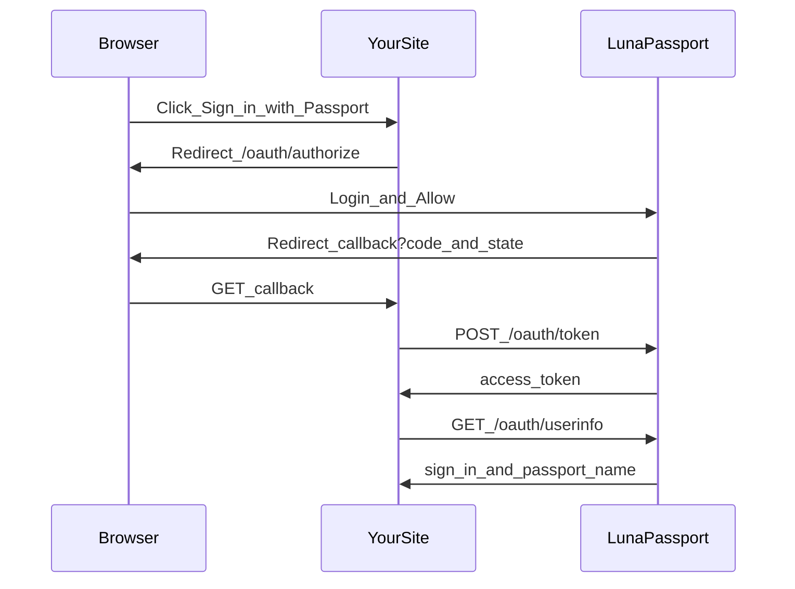

# Partner SSO guide

How to sign users into **your** website with LunaPassport.

LunaPassport still emulates classic .NET Passport SSI 1.4 for Windows XP.
On top of that it exposes a small partner surface:

| Path | When to use |
| --- | --- |
| **OAuth 2.0 Authorization Code** | Any modern site on any domain |
| **Classic Passport partner** | Sites that share `PASSPORT_COOKIE_DOMAIN` with LunaPassport |

This is a lab IdP. Tokens are not accepted by real Microsoft services.

## Choose a path

```mermaid
flowchart TD
  start[Need_sign_in_on_my_site]
  start --> q{Same_parent_cookie_domain?}
  q -->|yes_optional| classic[Classic_MSPAuth_cookies]
  q -->|no_or_any_domain| oauth[OAuth_Authorization_Code]
  classic --> partners[/partners_register_return_URL]
  oauth --> partners2[/partners_register_redirect_URI]
```

- **Different domain** (`shop.example.com` vs `passport.lab`) → **OAuth only**.
- **Same parent domain** (`app.alexsyw.me` + `passport-staging.alexsyw.me` with cookie domain `.alexsyw.me`) → classic cookies **or** OAuth.

## Register an application

1. Start LunaPassport and open `/partners`.
2. Sign in with a Passport account (seeded lab user: `test@example.com` / `testpass`).
3. Create an application:
   - **Name** — shown on the consent screen
   - **Redirect URIs** — one exact URI per line
   - **Classic partner** — check if you need `MSPAuth` redirects on the shared cookie domain
4. Copy `client_id` and `client_secret` immediately. The secret is shown once (rotate later from the same page).

Secrets are stored hashed with `OAUTH_SECRET_PEPPER` / `-oauth-secret-pepper`.

## OAuth 2.0 (any website)

### Flow



### Endpoints

| Method | Path | Role |
| --- | --- | --- |
| `GET` | `/oauth/authorize` | Start login; query: `response_type=code`, `client_id`, `redirect_uri`, `state` |
| `GET`/`POST` | `/oauth/login` | HTML email/password form (also used by `/partners`) |
| `POST` | `/oauth/authorize/consent` | Allow / Deny → redirect with `code` or `error` |
| `POST` | `/oauth/token` | Exchange code for `access_token` |
| `GET` | `/oauth/userinfo` | Bearer token → profile JSON |
| `POST` | `/oauth/revoke` | Invalidate an access token |

### Authorize

```text
GET https://PASSPORT_HOST/oauth/authorize
  ?response_type=code
  &client_id=CLIENT_ID
  &redirect_uri=https://yoursite.example/callback
  &state=RANDOM_CSRF_VALUE
```

- If the browser already has a valid `PPAuth` cookie, LunaPassport skips the password form (SSO) and shows consent.
- `redirect_uri` must match a registered URI **exactly** (scheme, host, path, no extra slash games).

Success redirect:

```text
https://yoursite.example/callback?code=...&state=...
```

Denial / error redirect:

```text
https://yoursite.example/callback?error=access_denied&error_description=...&state=...
```

### Token exchange

```http
POST /oauth/token
Content-Type: application/x-www-form-urlencoded

grant_type=authorization_code
&code=AUTH_CODE
&redirect_uri=https://yoursite.example/callback
&client_id=CLIENT_ID
&client_secret=CLIENT_SECRET
```

Client credentials may also be sent via HTTP Basic (`client_id:client_secret`).

Response:

```json
{
  "access_token": "...",
  "token_type": "Bearer",
  "expires_in": 3600
}
```

Authorization codes are single-use and expire in about five minutes. Access tokens expire in about one hour.

### Userinfo

```http
GET /oauth/userinfo
Authorization: Bearer ACCESS_TOKEN
```

```json
{
  "sub": "test@example.com",
  "sign_in": "test@example.com",
  "passport_name": "Test Passport"
}
```

### Revoke

```http
POST /oauth/revoke
Content-Type: application/x-www-form-urlencoded

token=ACCESS_TOKEN
```

### Minimal Go callback sample

```go
package main

import (
	"encoding/json"
	"io"
	"net/http"
	"net/url"
)

const (
	passportBase = "https://passport-staging.alexsyw.me"
	clientID     = "YOUR_CLIENT_ID"
	clientSecret = "YOUR_CLIENT_SECRET"
	redirectURI  = "https://yoursite.example/callback"
)

func handleLogin(w http.ResponseWriter, r *http.Request) {
	state := "replace-with-csrf-token"
	q := url.Values{}
	q.Set("response_type", "code")
	q.Set("client_id", clientID)
	q.Set("redirect_uri", redirectURI)
	q.Set("state", state)
	http.Redirect(w, r, passportBase+"/oauth/authorize?"+q.Encode(), http.StatusFound)
}

func handleCallback(w http.ResponseWriter, r *http.Request) {
	if r.URL.Query().Get("error") != "" {
		http.Error(w, r.URL.Query().Get("error_description"), http.StatusBadRequest)
		return
	}
	// Compare r.URL.Query().Get("state") to the value you stored in the session.

	form := url.Values{}
	form.Set("grant_type", "authorization_code")
	form.Set("code", r.URL.Query().Get("code"))
	form.Set("redirect_uri", redirectURI)
	form.Set("client_id", clientID)
	form.Set("client_secret", clientSecret)

	tokenResp, err := http.PostForm(passportBase+"/oauth/token", form)
	if err != nil {
		http.Error(w, err.Error(), http.StatusBadGateway)
		return
	}
	defer tokenResp.Body.Close()
	var token struct {
		AccessToken string `json:"access_token"`
	}
	_ = json.NewDecoder(tokenResp.Body).Decode(&token)

	req, _ := http.NewRequest(http.MethodGet, passportBase+"/oauth/userinfo", nil)
	req.Header.Set("Authorization", "Bearer "+token.AccessToken)
	infoResp, err := http.DefaultClient.Do(req)
	if err != nil {
		http.Error(w, err.Error(), http.StatusBadGateway)
		return
	}
	defer infoResp.Body.Close()
	body, _ := io.ReadAll(infoResp.Body)
	w.Header().Set("Content-Type", "application/json")
	_, _ = w.Write(body)
}

func main() {
	http.HandleFunc("/login", handleLogin)
	http.HandleFunc("/callback", handleCallback)
	_ = http.ListenAndServe(":3000", nil)
}
```

Register `https://yoursite.example/callback` on `/partners` before testing.

## Classic Passport partner (shared cookie domain)

### Requirements

- Your site host is under the same parent as `PASSPORT_COOKIE_DOMAIN` (example: `.alexsyw.me`).
- The return URL is registered on `/partners` with **classic Passport partner** enabled.

Cookies `MSPAuth` / `MSPProf` / `PPAuth` are scoped to that parent domain. They will **not** appear on unrelated domains — use OAuth there.

### Browser flow

1. Send the user to:

```text
GET https://PASSPORT_HOST/login2.srf?browser=1&ru=https://app.alexsyw.me/passport/return
```

2. After login (HTML path / existing `PPAuth`), LunaPassport:
   - sets `PPAuth` and partner cookies
   - redirects to `ru` **only if** it is allowlisted

Alternative after an existing browser session:

```text
GET https://PASSPORT_HOST/partner/complete?ru=https://app.alexsyw.me/passport/return
```

### Verify session

```http
GET /partner/verify
Cookie: MSPAuth=TOKEN
```

```json
{"authenticated":true,"sign_in":"test@example.com","passport_name":"Test Passport"}
```

Lab helper that prints the signed-in user as plain text:

```text
GET /partner
```

### WinHTTP / SSI (unchanged)

Windows XP and WinHTTP still use:

```http
Authorization: Passport1.4 sign-in=...&pwd=...&OrgUrl=...
```

Successful SSI responses return `Authentication-Info` with `from-PP` and `ru=` **without** an HTTP redirect. That path is for protocol clients, not modern browsers.

## Cookies and tokens

| Name | Kind | Lifetime (approx.) | Purpose |
| --- | --- | --- | --- |
| `PPAuth` | Cookie | 30 days | Passport session on the shared cookie domain |
| `MSPAuth` | Cookie | session-style partner cookie | Classic partner site auth |
| `MSPProf` | Cookie | partner profile blob | Mock profile (`mock-profile`) |
| OAuth auth code | Server | 5 minutes, one-time | Browser → site handoff |
| OAuth access token | Opaque Bearer | 1 hour | Site → `/oauth/userinfo` |

## Admin URLs

| URL | Purpose |
| --- | --- |
| `/partners` | Create / list / rotate / disable / delete apps |
| `/oauth/login` | Browser sign-in |
| `/ppsecure/MSRV_EditProfile.asp` | Edit Passport profile |
| `/logout` | Clear Passport cookies / session |
| `/static/netpass/index.html` | Lab landing page |

## Troubleshooting

| Symptom | Likely cause |
| --- | --- |
| `redirect_uri is not registered` | URI string differs from `/partners` (http vs https, trailing slash, port) |
| Classic redirect rejected | Classic checkbox off, or URI not allowlisted |
| Cookies missing on partner site | Host not under `PASSPORT_COOKIE_DOMAIN`, or TLS / Secure cookie mismatch |
| Consent skipped password but fails | Stale `PPAuth` — use `/logout` and sign in again |
| `invalid_grant` on token | Code already used, expired, or `redirect_uri` mismatch |
| XP SSI broken after partner changes | Unlikely if you did not change Authorization responses; re-run `go test ./...` |

## Related README sections

- Quick start and Docker: repository [README](../README.md)
- Windows XP hosts / registry: README “Windows XP”
- Russian guide: [partner-sso.ru.md](partner-sso.ru.md)
