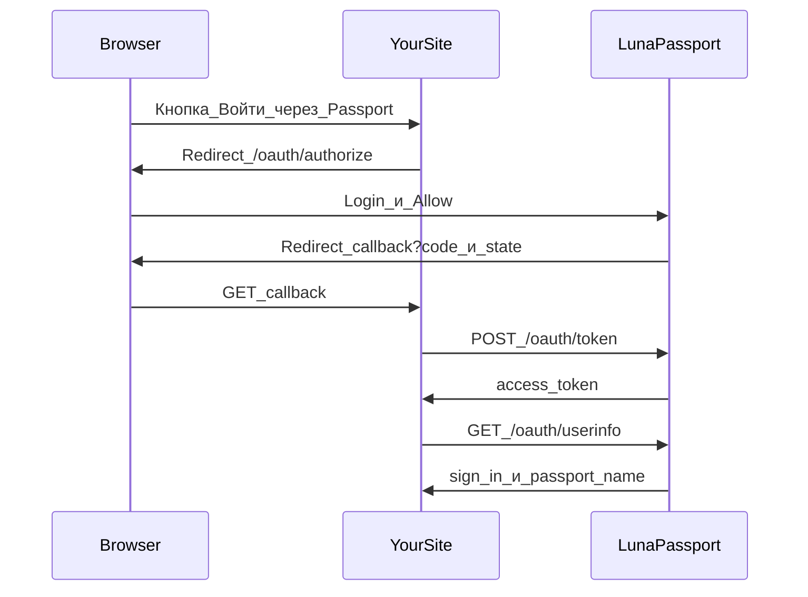

# Руководство по Partner SSO

Как впустить пользователей на **свой** сайт через LunaPassport.

LunaPassport по-прежнему эмулирует классический .NET Passport SSI 1.4 для
Windows XP. Поверх этого есть partner-поверхность:

| Способ | Когда использовать |
| --- | --- |
| **OAuth 2.0 Authorization Code** | Любой современный сайт на любом домене |
| **Классический Passport partner** | Сайты на том же `PASSPORT_COOKIE_DOMAIN`, что и LunaPassport |

Это лабораторный IdP. Токены не принимаются реальными сервисами Microsoft.

## Какой путь выбрать

```mermaid
flowchart TD
  start[Нужен_вход_на_мой_сайт]
  start --> q{Общий_родительский_cookie_домен?}
  q -->|да_опционально| classic[Classic_MSPAuth_cookies]
  q -->|нет_или_любой_домен| oauth[OAuth_Authorization_Code]
  classic --> partners[/partners_зарегистрировать_return_URL]
  oauth --> partners2[/partners_зарегистрировать_redirect_URI]
```

- **Чужой домен** (`shop.example.com` vs `passport.lab`) → **только OAuth**.
- **Общий parent domain** (`app.lunastore.app` + `passport-staging.lunastore.app` при
  cookie domain `.lunastore.app`) → classic cookies **или** OAuth.

## Регистрация приложения

1. Запустите LunaPassport и откройте `/partners`.
2. Войдите Passport-аккаунтом (seed: `test@example.com` / `testpass`).
3. Создайте приложение:
   - **Name** — имя на экране согласия
   - **Redirect URIs** — по одному точному URI на строку
   - **Classic partner** — включите, если нужны redirect с `MSPAuth` на общем cookie-домене
4. Сразу скопируйте `client_id` и `client_secret`. Секрет показывается один раз
   (позже можно rotate на той же странице).

Секреты хранятся как hash с `OAUTH_SECRET_PEPPER` / `-oauth-secret-pepper`.
Список / rotate / disable / delete доступны только владельцу приложения.

## Совместимость (OAuth 2.0 vs OIDC)

LunaPassport — IdP для **confidential-клиента** по OAuth 2.0 Authorization Code.
Это **не** полноценный OpenID Connect провайдер.

| Возможность | Поддержка |
| --- | --- |
| Authorization Code (`response_type=code`) | Да |
| Client secret (form body или HTTP Basic) | Да |
| Exact allowlist `redirect_uri` | Да |
| Opaque Bearer access token | Да |
| `/oauth/userinfo` (`sub`, `sign_in`, `passport_name`) | Да |
| Отзыв токена | Да |
| `state` (проверяет **ваш** сайт) | Pass-through |
| OIDC discovery (`.well-known/openid-configuration`) | Нет |
| `id_token` / JWKS | Нет |
| PKCE | Нет (для Django + secret не нужен) |
| Refresh tokens / scopes | Нет |

**Django:** Authlib / `requests-oauthlib` или кастомный django-allauth
`OAuth2Provider` с ручными URL. Auto-OIDC discovery (как у Google) не сработает.

## OAuth 2.0 (любой сайт)

### Поток



### Эндпоинты

| Метод | Путь | Назначение |
| --- | --- | --- |
| `GET` | `/oauth/authorize` | Старт входа; query: `response_type=code`, `client_id`, `redirect_uri`, `state` |
| `GET`/`POST` | `/oauth/login` | HTML-форма email/password (также для `/partners`) |
| `POST` | `/oauth/authorize/consent` | Allow / Deny → redirect с `code` или `error` |
| `POST` | `/oauth/token` | Обмен code на `access_token` |
| `GET` | `/oauth/userinfo` | Bearer → JSON профиля |
| `POST` | `/oauth/revoke` | Отзыв access token |

### Authorize

```text
GET https://PASSPORT_HOST/oauth/authorize
  ?response_type=code
  &client_id=CLIENT_ID
  &redirect_uri=https://yoursite.example/callback
  &state=RANDOM_CSRF_VALUE
```

- Если в браузере уже есть валидный `PPAuth`, форма пароля пропускается (SSO),
  сразу показывается consent.
- `redirect_uri` должен совпадать с зарегистрированным **байт в байт**.

Успех:

```text
https://yoursite.example/callback?code=...&state=...
```

Отказ / ошибка:

```text
https://yoursite.example/callback?error=access_denied&error_description=...&state=...
```

### Обмен токена

```http
POST /oauth/token
Content-Type: application/x-www-form-urlencoded

grant_type=authorization_code
&code=AUTH_CODE
&redirect_uri=https://yoursite.example/callback
&client_id=CLIENT_ID
&client_secret=CLIENT_SECRET
```

Либо HTTP Basic (`client_id:client_secret`).

Ответ:

```json
{
  "access_token": "...",
  "token_type": "Bearer",
  "expires_in": 3600
}
```

Код одноразовый (~5 минут). Access token живёт около часа.

### Userinfo

```http
GET /oauth/userinfo
Authorization: Bearer ACCESS_TOKEN
```

```json
{
  "sub": "test@example.com",
  "sign_in": "test@example.com",
  "passport_name": "Test Passport"
}
```

### Revoke

```http
POST /oauth/revoke
Content-Type: application/x-www-form-urlencoded

token=ACCESS_TOKEN
```

### Django (Authlib) — рекомендуемый путь для современных сайтов

Зарегистрируйте на `/partners` точный redirect URI:

```text
https://yourdjango.example/accounts/passport/callback/
```

Установите Authlib и подключите два view (эскиз):

```python
# pip install Authlib requests
import secrets
from authlib.integrations.requests_client import OAuth2Session
from django.conf import settings
from django.contrib.auth import get_user_model, login
from django.http import HttpResponseBadRequest
from django.shortcuts import redirect

PASSPORT = settings.LUNAPASSPORT_BASE  # например https://passport-staging.alexsyw.me
CLIENT_ID = settings.LUNAPASSPORT_CLIENT_ID
CLIENT_SECRET = settings.LUNAPASSPORT_CLIENT_SECRET
REDIRECT_URI = settings.LUNAPASSPORT_REDIRECT_URI
AUTHORIZE_URL = f"{PASSPORT}/oauth/authorize"
TOKEN_URL = f"{PASSPORT}/oauth/token"
USERINFO_URL = f"{PASSPORT}/oauth/userinfo"


def passport_login(request):
    state = secrets.token_urlsafe(24)
    request.session["oauth_state"] = state
    client = OAuth2Session(CLIENT_ID, CLIENT_SECRET, redirect_uri=REDIRECT_URI, state=state)
    uri, _ = client.create_authorization_url(AUTHORIZE_URL)
    return redirect(uri)


def passport_callback(request):
    if request.GET.get("error"):
        return HttpResponseBadRequest(request.GET.get("error_description", "oauth error"))
    if request.GET.get("state") != request.session.get("oauth_state"):
        return HttpResponseBadRequest("state mismatch")

    client = OAuth2Session(CLIENT_ID, CLIENT_SECRET, redirect_uri=REDIRECT_URI)
    token = client.fetch_token(
        TOKEN_URL,
        authorization_response=request.build_absolute_uri(),
        client_secret=CLIENT_SECRET,
    )
    resp = client.get(USERINFO_URL)
    resp.raise_for_status()
    profile = resp.json()  # sub / sign_in / passport_name

    User = get_user_model()
    user, _ = User.objects.get_or_create(
        username=profile["sign_in"],
        defaults={"email": profile["sign_in"]},
    )
    login(request, user)
    return redirect("/")
```

`client_secret` только в Django settings / env — никогда в JS браузера.

**django-allauth:** кастомный `OAuth2Provider` с `authorize_url`,
`access_token_url`, `profile_url` на три эндпоинта выше; маппинг `sub` /
`sign_in` на локального пользователя. OIDC auto-discovery для LunaPassport
не включайте.

### Заметки по безопасности (partner-сайты)

- Всегда генерируйте и проверяйте `state` в сессии своего приложения.
- `redirect_uri` должен совпадать **байт в байт** (схема, хост, путь, слэш).
- LunaPassport — **лабораторный** IdP: изолированная сеть; токены не для
  реальных сервисов Microsoft.
- `client_secret` только на сервере.
- Формы IdP (login/consent/`/partners`) защищены CSRF-cookie `LPCsrf`; на
  стороне Django всё равно нужны свой CSRF и проверка `state`.

### Минимальный Go-пример callback

```go
package main

import (
	"encoding/json"
	"io"
	"net/http"
	"net/url"
)

const (
	passportBase = "https://passport-staging.lunastore.app"
	clientID     = "YOUR_CLIENT_ID"
	clientSecret = "YOUR_CLIENT_SECRET"
	redirectURI  = "https://yoursite.example/callback"
)

func handleLogin(w http.ResponseWriter, r *http.Request) {
	state := "replace-with-csrf-token"
	q := url.Values{}
	q.Set("response_type", "code")
	q.Set("client_id", clientID)
	q.Set("redirect_uri", redirectURI)
	q.Set("state", state)
	http.Redirect(w, r, passportBase+"/oauth/authorize?"+q.Encode(), http.StatusFound)
}

func handleCallback(w http.ResponseWriter, r *http.Request) {
	if r.URL.Query().Get("error") != "" {
		http.Error(w, r.URL.Query().Get("error_description"), http.StatusBadRequest)
		return
	}
	// Сверьте state с значением из вашей сессии.

	form := url.Values{}
	form.Set("grant_type", "authorization_code")
	form.Set("code", r.URL.Query().Get("code"))
	form.Set("redirect_uri", redirectURI)
	form.Set("client_id", clientID)
	form.Set("client_secret", clientSecret)

	tokenResp, err := http.PostForm(passportBase+"/oauth/token", form)
	if err != nil {
		http.Error(w, err.Error(), http.StatusBadGateway)
		return
	}
	defer tokenResp.Body.Close()
	var token struct {
		AccessToken string `json:"access_token"`
	}
	_ = json.NewDecoder(tokenResp.Body).Decode(&token)

	req, _ := http.NewRequest(http.MethodGet, passportBase+"/oauth/userinfo", nil)
	req.Header.Set("Authorization", "Bearer "+token.AccessToken)
	infoResp, err := http.DefaultClient.Do(req)
	if err != nil {
		http.Error(w, err.Error(), http.StatusBadGateway)
		return
	}
	defer infoResp.Body.Close()
	body, _ := io.ReadAll(infoResp.Body)
	w.Header().Set("Content-Type", "application/json")
	_, _ = w.Write(body)
}

func main() {
	http.HandleFunc("/login", handleLogin)
	http.HandleFunc("/callback", handleCallback)
	_ = http.ListenAndServe(":3000", nil)
}
```

Перед тестом зарегистрируйте `https://yoursite.example/callback` на `/partners`.

## Классический Passport partner (общий cookie-домен)

### Требования

- Хост сайта лежит под тем же parent, что и `PASSPORT_COOKIE_DOMAIN`
  (пример: `.lunastore.app`).
- Return URL зарегистрирован на `/partners` с включённым **classic Passport partner**.

Cookies `MSPAuth` / `MSPProf` / `PPAuth` привязаны к parent domain. На чужих
доменах их не будет — там только OAuth.

### Браузерный поток

1. Отправьте пользователя на:

```text
GET https://PASSPORT_HOST/login2.srf?browser=1&ru=https://app.lunastore.app/passport/return
```

2. После входа LunaPassport:
   - выставляет `PPAuth` и partner-cookies
   - делает redirect на `ru` **только если** URI в allowlist

Альтернатива при уже существующей browser-сессии:

```text
GET https://PASSPORT_HOST/partner/complete?ru=https://app.lunastore.app/passport/return
```

### Проверка сессии

```http
GET /partner/verify
Cookie: MSPAuth=TOKEN
```

```json
{"authenticated":true,"sign_in":"test@example.com","passport_name":"Test Passport"}
```

Лабораторный plain-text helper:

```text
GET /partner
```

### WinHTTP / SSI (без изменений)

Windows XP и WinHTTP по-прежнему используют:

```http
Authorization: Passport1.4 sign-in=...&pwd=...&OrgUrl=...
```

Успешный SSI-ответ отдаёт `Authentication-Info` с `from-PP` и `ru=` **без**
HTTP-redirect. Это путь для protocol-клиентов, не для современных браузеров.

## Cookies и токены

| Имя | Тип | Срок (примерно) | Назначение |
| --- | --- | --- | --- |
| `PPAuth` | Cookie | 30 дней | Passport-сессия на cookie-домене |
| `MSPAuth` | Cookie | partner-cookie | Classic partner auth |
| `MSPProf` | Cookie | profile blob | Mock-профиль (`mock-profile`) |
| OAuth auth code | Сервер | 5 минут, один раз | Handoff браузер → сайт |
| OAuth access token | Opaque Bearer | 1 час | Сайт → `/oauth/userinfo` |

## Админ-URL

| URL | Назначение |
| --- | --- |
| `/partners` | Создание / список / rotate / disable / delete приложений |
| `/oauth/login` | Браузерный вход |
| `/ppsecure/MSRV_EditProfile.asp` | Профиль Passport |
| `/logout` | Сброс cookies / сессии |
| `/static/netpass/index.html` | Lab landing |

## Troubleshooting

| Симптом | Вероятная причина |
| --- | --- |
| `redirect_uri is not registered` | URI отличается от записи в `/partners` (http/https, слэш, порт) |
| Classic redirect отклонён | Не включён classic, или URI не в allowlist |
| Cookies нет на partner-сайте | Хост не под `PASSPORT_COOKIE_DOMAIN`, или Secure/TLS mismatch |
| Consent без пароля, но ошибка | Протухший `PPAuth` — `/logout` и снова войти |
| `invalid_grant` на token | Код уже использован, истёк, или другой `redirect_uri` |
| Сломался XP SSI | Маловероятно при неизменённых Authorization-ответах; `go test ./...` |

## Связанные разделы README

- Быстрый старт и Docker: [README.ru.md](../README.ru.md)
- Windows XP hosts / registry: раздел «Windows XP»
- English guide: [partner-sso.md](partner-sso.md)
